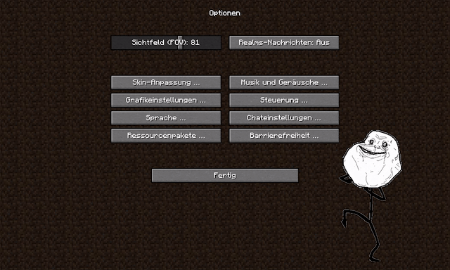

## About

FancyMenu is a forge-based minecraft mod to customize ingame menus in many ways.

A special thing about FancyMenu is, that its not limited to the basic minecraft menus like the options or inventory menu. 
With FancyMenu, its possible to customize nearly every default-looking menu in the game. Even menus from other mods.

Some of its key features are: 
- Hide, move resize and rename buttons 
- Add lines of text to menu screens and format them 
- Animate the background of menus 
- Add textures and animations to menus 

## The FancyMenu Animation Engine

The animation engine used by FancyMenu can render smooth looking animations, even if they have a high resolution!

Making your own animations is super easy and can be done by everyone.

### Animation Intros

Animations can have intros, which will be played before the main animation starts. 
These will only be played once, even if the animation is in loop mode.

### Transparent Animations

It is possible to render frames with transparent backgrounds, which can be very useful when it comes to displaying animations as menu decoration.

## Customization Tools

FancyMenu has some small tools to help you customize your menus a little easier.

### Display Button and Menu Informations

By default, the mod will add three buttons at top of every supported menu. 
Two of these buttons are "Button Info" and "Menu Info".

With the first button, you can display useful informations about every button by just hovering over them with the mouse. 
It will display things like the width and height of a button, but the most important information it gives you is the button ID and the button key. 
These are used to specify a button, if you want to customize it.

The second one displays the menu identifier, which is important to specify the menu type of the menu you want to customize.

### Apply changes without restarting the game

The third button added to the top of every menu, is the "Reload" button. 
By pressing this button, you can apply changes made to customization files direclty to the game without restarting it, so you are being able to test changes without worrying about loosing time if its not as good looking as you thought.

### Hiding the tools

So, you don't want to see these ~ugly~ beautiful buttons everytime you open a menu?!

No problem! After you're done with customization, you can hide the buttons in the config.

## Documentation [The FancyMenu Wiki]

The [FancyMenu wiki](https://github.com/Keksuccino/FancyMenu/wiki) has some very helpful documentations about creating animations and customize menus, so check it out!
